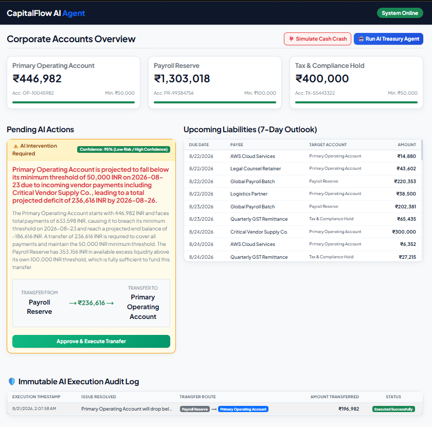
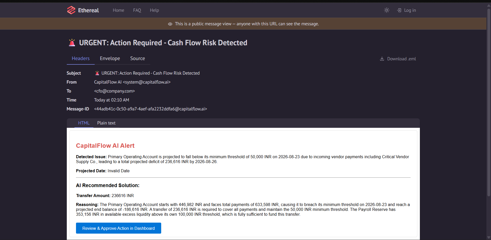
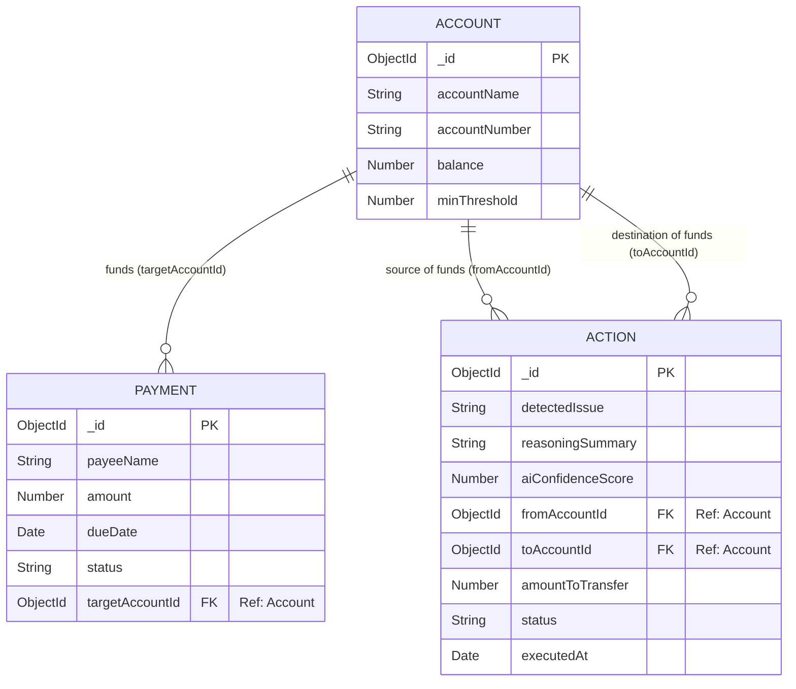

# CapitalFlow AI 🚀
**Track:** Open Track (Razorpay AI Buildathon)
**Deadline:** September 5, 2026
**Stack:** MERN (MongoDB, Express, React, Node.js) + HTML/CSS/Bootstrap/JS

## 📖 Mission Statement
CapitalFlow AI is an autonomous, AI-driven corporate treasury agent. It predicts upcoming cash flow shortages across multiple corporate bank accounts and automatically suggests or executes internal fund transfers to ensure liquidity and prevent overdrafts.

## 🏗️ Core Architecture
1.  **Data Ingestion:** A batch of 50+ synthetic records (accounts, balances, scheduled payments) stored in MongoDB.
2.  **AI Engine (Backend):** Node.js/Express backend that bundles the financial snapshot into a strict JSON prompt and sends it to the LLM (Gemini API).
3.  **Dynamic Dashboard (Frontend):** A responsive React interface featuring account health bars, live AI action cards with confidence ratings, upcoming liability tables, and an immutable execution audit log.
4.  **Notification System:** Nodemailer integration via Ethereal Email for critical CFO alerts.
5.  **Resiliency & Crisis Testing:** Includes a built-in 503 API fallback mechanism and an interactive "Simulate Cash Crash" demo mode to showcase real-time panic recovery.

```mermaid
sequenceDiagram
    participant U as CFO (Frontend UI)
    participant B as Express API (Backend)
    participant DB as MongoDB
    participant AI as Gemini 3.6 API

    U->>B: 1. Clicks "Run AI Agent"
    B->>DB: 2. Fetch Accounts & 7-Day Liabilities
    DB-->>B: Return JSON Data
    B->>AI: 3. Send strict system prompt + Financial State
    alt API Success
        AI-->>B: 4a. Return recommended transfer JSON
    else 503 Timeout / Limit Reached
        B-->>B: 4b. Trigger Graceful Fallback (Mock Data)
    end
    B->>DB: 5. Save pending action to database
    B-->>U: 6. Return Action Card to UI
    U->>B: 7. Clicks "Approve & Execute"
    B->>DB: 8. Deduct source, add to target, mark 'Executed'
    DB-->>B: Confirm balances updated
    B-->>U: 9. Refresh UI & Move to Audit Log
```

## 🗄️ Database Schema & Relations

## 🚦 Micro-Phase Completion Tracker

### Phase 1: Data Engine (Complete)
*   [x] 1.1 Init backend, packages, Express server.
*   [x] 1.2 MongoDB Connection & Schemas.
*   [x] 1.3 Synthetic Data Generator script.
*   [x] 1.4 Data CRUD API routes.

### Phase 2: AI Treasury Agent (Complete)
*   [x] 2.1 Configure Gemini API connection.
*   [x] 2.2 Draft constrained JSON system prompt.
*   [x] 2.3 Build AI analysis controller & database integration.
*   [x] 2.4 Integrate Nodemailer (Ethereal) for CFO alerts.

### Phase 3: Dynamic Reactive Frontend & Advanced Features (Complete)
*   [x] 3.1 Scaffold React UI, Vite config, and Bootstrap.
*   [x] 3.2 Build Dashboard & Navbar components.
*   [x] 3.3 Create interactive Action Approval cards with AI Confidence Risk Badges.
*   [x] 3.4 Implement state updates for balance adjustments and live execution.
*   [x] 3.5 Build Immutable AI Execution Audit Log table.
*   [x] 3.6 Implement "Simulate Cash Crash" interactive demo trigger.

## 🐛 Error Log & Post-Mortem (For Judges)
*Documenting bugs encountered during the sprint and how they were resolved to showcase problem-solving.*

*   **Issue:** Received `Cannot GET /api/ai/analyze` when initially testing the AI trigger.
    *   **Resolution:** Identified that browser address bars default to `GET` requests. Switched to VS Code Thunder Client to properly test the `POST` endpoint.
*   **Issue:** Encountered `404 Not Found` / `500 Internal Server Error` from the Gemini API during analysis. Terminal log revealed: `models/gemini-2.5-flash is no longer available to new users`.
    *   **Resolution:** Identified Google's API model deprecation. Updated `geminiService.js` configuration to utilize the requested `models/gemini-3.6-flash` model. 
*   **Issue:** Encountered `503 Service Unavailable` due to high demand on Google's Gemini servers, causing the backend request to fail.
    *   **Resolution:** Engineered a graceful fallback mechanism in `geminiService.js`. If the API throws a network or demand error, the catch block intercepts it and returns pre-calculated mock action data, ensuring the frontend UI remains fully operational and demo-ready.
*   **Issue:** Encountered `Unexpected end of JSON input while parsing empty string` during frontend initialization.
    *   **Resolution:** Removed the empty `package.json` file and successfully re-initialized the Vite environment using ES modules (`"type": "module"`).
*   **Issue:** Encountered `SyntaxError: Identifier 'getDashboardData' has already been declared` in backend routing.
    *   **Resolution:** Cleaned up duplicate imports in `backend/routes/api.js` to establish a single, unified controller import statement.

## ⚠️ AI Developer Guidelines
*   **No Hallucinations:** All AI logic must rely strictly on the MongoDB synthetic dataset.
*   **Output Constraint:** The AI Controller must strictly output valid JSON. 
*   **UI Focus:** The frontend must heavily utilize clean HTML, CSS, JavaScript, and Bootstrap principles.